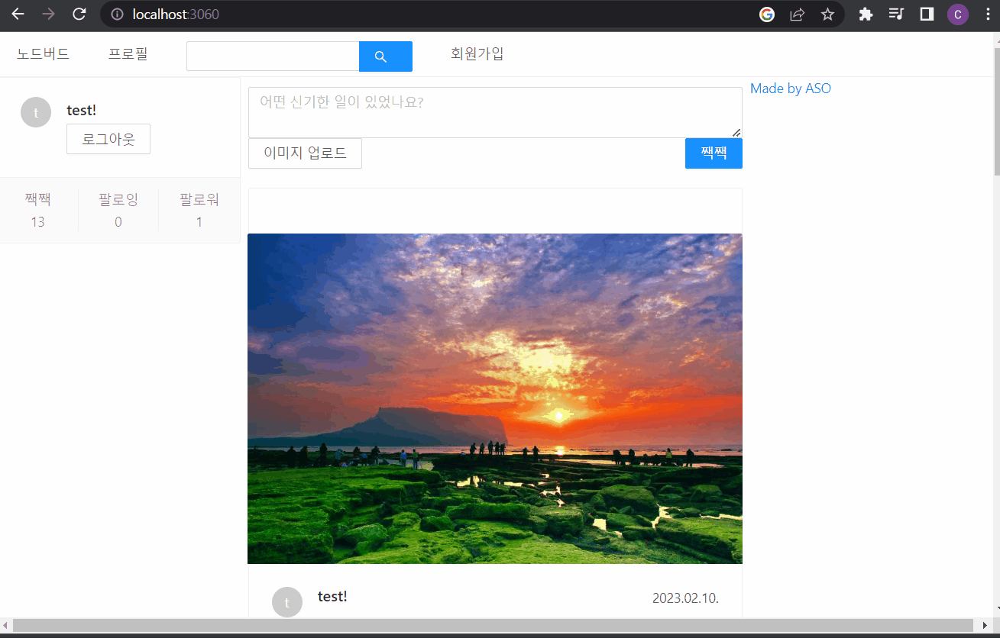

# 프로젝트 목적

snext, redux를 이용해서 서비스 만들기,서버사이드렌더링 이해를 돕기 위해
mysql,sequilize 사용하기 

# 기술 스펙

- node.js
- next
  -styled-component

- nest
- DB: MYSQL
- aws(ec2) 배포,s3

배포)http://asonodebird.coding-factory.co.kr/

## back

- user : 유저의 정보 불러오기,정보 업데이트 등
- post : 게시글 등록,삭제 등 구현, 팔로우 언팔로우 등 구현
- posts: 게시글 10개씩 불러오기
- hashtag: hashtag된 게시글 불러오기

## front

-'/' : 유저의 프로필과 포스터들

- 포스터는 10개씩 보여줄 수 있게 구현함(무한스크롤)

- '/user/:id': 유저가 쓴 글들만 따로 보여줌
- '/hashtag/:tag': 유저의 쓴글에 해시태그된 글만 보여줌

- 이미지와 글 그리고 태그들을 post 할수 있음 

- 팔로우 언팔로우를 할 수 있음 
- 자신의 팔로우 팔로워를 한번에 볼 수 있음 

